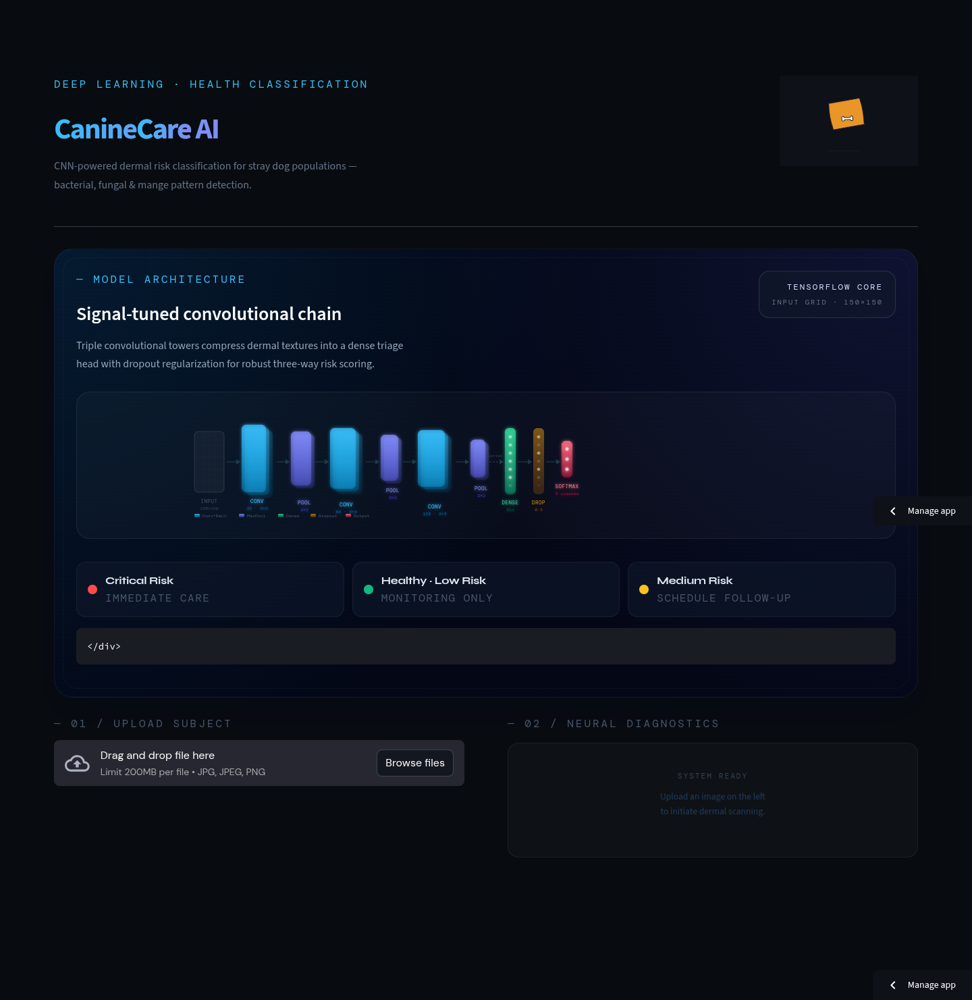
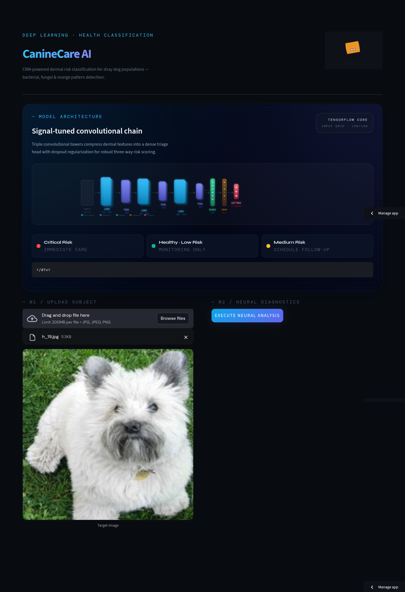
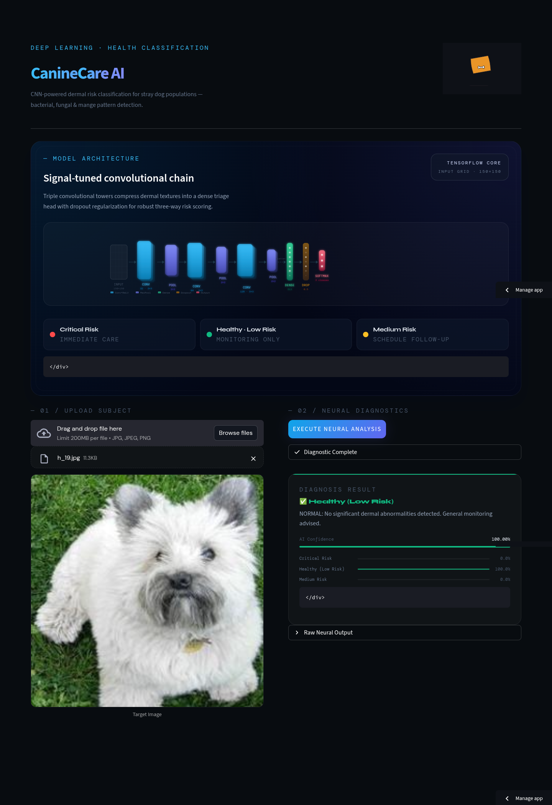

# CanineCare AI — Stray Dog Health Risk Classifier

Powered by TensorFlow 2.x, Keras, and Streamlit

---

## What This Project Does

CanineCare AI is a convolutional neural network (CNN) that inspects close-up photos of stray dogs' skin and assigns one of three actionable health-risk levels. The Streamlit front end visualises the full inference pipeline, shows class probabilities, and explains why each prediction matters.

| Category | What it means |
|---|---|
| **Healthy (Low Risk)** | Clear dermal surface; routine monitoring only. |
| **Medium Risk** | Visual cues of fungal infections or allergic dermatitis; veterinary check recommended. |
| **Critical Risk** | Bacterial infections, mange, or open wounds; urgent veterinary care required. |

---

## Tech Stack

| Layer | Tools & Services | Notes |
|---|---|---|
| Data & Experimentation | Kaggle API, Google Colab (T4 GPU), NumPy, Pandas | Dataset download, balancing, augmentation, and exploratory analysis inside Colab. |
| Model Training | TensorFlow 2.x, Keras, GPU-backed runtime | Custom sequential CNN with callbacks (`EarlyStopping`, `ReduceLROnPlateau`). |
| Serving & UI | Streamlit, streamlit-lottie, Pillow | Interactive upload/preprocessing, animated pipeline, probability dashboard. |
| Utilities | Python 3.9–3.11, virtualenv/venv, Git | Recommended runtime versions and workflow tooling. |

---

## Project Structure

```
SSMDA/
├── app_final.py                 # Streamlit web application (entry point)
├── dog_health_cnn.keras         # Trained CNN weights (exported from Colab)
├── StrayDogCNN_SSDM_50.ipynb    # Google Colab notebook for data + training
├── requirements.txt             # Python dependencies
├── stray-dog-cnn/               # Packaged dataset + trained model for backup
│   ├── data/
│   │   ├── critical_risk/
│   │   ├── low_risk/
│   │   └── medium_risk/
│   └── model/dog_health_cnn.keras
├── dogs-skin-disease-dataset/   # Raw Kaggle disease dataset
└── stanford-dogs-dataset-traintest/   # Raw Stanford dogs dataset (healthy class)
```

---

## Model Architecture

The CNN follows a classic feature-extraction plus dense classification head design:

```
Input (150×150×3)
    │
    ├─ Conv2D(32, 3×3, ReLU) → MaxPool(2×2)
    ├─ Conv2D(64, 3×3, ReLU) → MaxPool(2×2)
    ├─ Conv2D(128, 3×3, ReLU) → MaxPool(2×2)
    │
    ├─ Flatten
    ├─ Dense(512, ReLU)
    ├─ Dropout(0.5)
    └─ Dense(3, Softmax)  →  [Critical, Healthy, Medium]
```

### Why this design works
- Progressive convolution blocks (32 → 64 → 128 filters) capture coarse-to-fine skin patterns such as rashes, colour changes, and follicular textures.
- MaxPooling halves spatial dimensions after each block, encouraging translational invariance while keeping the network lightweight enough for edge devices.
- A high-capacity dense layer (512 units) combines global texture cues before the softmax head.
- Dropout prevents dense-layer memorisation, improving generalisation on unseen street photos.

**Class index order (alphabetical from `flow_from_directory`):**

| Index | Folder name | Label |
|---|---|---|
| 0 | `critical_risk` | Critical Risk |
| 1 | `low_risk` | Healthy (Low Risk) |
| 2 | `medium_risk` | Medium Risk |

---

## How the CNN Works End-to-End

1. **Preprocess upload** — Streamlit resizes the uploaded image to 150×150 px and normalises pixel values to $[0, 1]$.
2. **Feature extraction** — Three convolution + pooling blocks detect localised edges, skin lesions, and colour gradients at increasing receptive fields.
3. **Flatten + dense reasoning** — Learned texture maps are flattened and passed through a 512-unit dense layer that models co-occurring features (e.g., redness + patchiness).
4. **Dropout regularisation** — A 50% dropout rate reduces overfitting by randomly zeroing dense activations during training.
5. **Softmax decision** — The final dense layer outputs logits for the three risk classes; `softmax` converts them to probabilities that sum to 1.
6. **UI feedback** — Streamlit renders the predicted class, probability bars, and textual guidance for each risk level.

---

## Dataset & Augmentation

Two Kaggle datasets are merged and balanced to 1,000 images per class (3,000 total):

| Source | Role |
|---|---|
| [Stanford Dogs Dataset](https://www.kaggle.com/datasets/miljan/stanford-dogs-dataset-traintest) | Supplies high-quality healthy-class images. |
| [Dogs Skin Disease Dataset](https://www.kaggle.com/datasets/yashmotiani/dogs-skin-disease-dataset) | Provides fungal/allergic (medium) and bacterial (critical) cases. |

**Balancing strategy:** Each class is capped at 1,000 samples via modulo sampling so that no dataset is discarded even if the source class is smaller.

**Train/validation split:** 80% / 20% using `ImageDataGenerator(validation_split=0.2)`.

**On-the-fly augmentation:**
- Random rotation ±20°
- Width/height shift ±20%
- Horizontal flip
- `fill_mode="nearest"`

This keeps the model robust to handheld photography, orientation changes, and cropped lesions.

---

## Training Workflow (Google Colab)

1. Open `StrayDogCNN_SSDM_50.ipynb` in [Google Colab](https://colab.research.google.com) and switch the runtime to **GPU (T4)**.
2. Store your Kaggle credentials under **Runtime → Manage sessions → Secrets** (`KAGGLE_USERNAME`, `KAGGLE_KEY`) and enable notebook access.
3. Run the notebook cells sequentially:
   | Cell | Purpose |
   |---|---|
   | 1 | Bootstrap folders, import libs, authenticate Kaggle. |
   | 2 | Download datasets, balance to 1,000 images per class. |
   | 3 | Build training/validation generators with augmentation. |
   | 4 | Define the CNN (see architecture above). |
   | 5 | Train with callbacks (`EarlyStopping`, `ReduceLROnPlateau`). |
   | 6 | Plot accuracy/loss curves and confusion metrics. |
   | 7 | Save `dog_health_cnn.keras` and auto-download to your machine. |
4. Place the exported `.keras` file in the repository root (same level as `app_final.py`).

**Callback config:**
- `EarlyStopping(patience=5, monitor="val_accuracy")`
- `ReduceLROnPlateau(patience=3, factor=0.5, monitor="val_loss")`
- Max 30 epochs (typically halts earlier due to EarlyStopping).

---

## Deployment & Streamlit App

- The UI is implemented in `app_final.py` and powered by Streamlit.
- Model loading is wrapped in `@st.cache_resource` so weights initialise once per session.
- A Lottie animation illustrates the inference pipeline; failure to load (offline use) gracefully falls back to a static layout.
- Predictions are contextualised with plain-language advice for each class to aid field workers or NGOs.

### Running Locally

> TensorFlow wheels are only stable up to Python 3.11 today—prefer 3.10 for parity with Colab.

1. **Clone the project**
   ```bash
   git clone <your-repo-url>
   cd SSMDA
   ```
2. **Create & activate a virtual environment**
   ```bash
   python -m venv .venv
   source .venv/bin/activate      # Linux/macOS
   .venv\Scripts\activate        # Windows
   ```
3. **Install dependencies**
   ```bash
   pip install -r requirements.txt
   ```
4. **Place the trained model** — Ensure `dog_health_cnn.keras` sits beside `app_final.py`.
5. **Launch Streamlit**
   ```bash
   streamlit run app_final.py
   ```
6. Open `http://localhost:8501` in your browser.

---

## Requirements

```
streamlit>=1.32.0
tensorflow>=2.13.0
Pillow>=10.0.0
numpy>=1.24.0
requests>=2.31.0
streamlit-lottie>=0.0.5
```

Add `kaggle`, `pandas`, and `matplotlib` inside Colab if you plan to re-train.

---

## Resources & References

- Model training notebook: `StrayDogCNN_SSDM_50.ipynb` (Google Colab).
- Datasets: Stanford Dogs + Dogs Skin Disease (linked above).
- TensorFlow 2.x & Keras docs for Sequential/Conv2D APIs.
- Streamlit docs for file uploaders, caching, and layout primitives.
- LottieFiles animation used in the hero section (optional cosmetic asset).

---

## Known Issues & Notes

- **Model metadata mismatch** — Some TensorFlow releases throw `quantization_config` warnings when calling `tf.keras.models.load_model`. The app rebuilds the architecture in code and loads weights via `model.load_weights()` to stay version-agnostic.
- **Missing weights** — If `dog_health_cnn.keras` is absent, Streamlit displays a warning and disables inference until the file is provided.
- **Large image uploads** — Images >8 MB take longer to preprocess; resize them to ~1080p before uploading for faster UX.

---
## UI
<div style="display:flex; gap:1%; justify-content:space-between;">
   
   
   
</div>

## License

Academic project — not licensed for commercial use.
